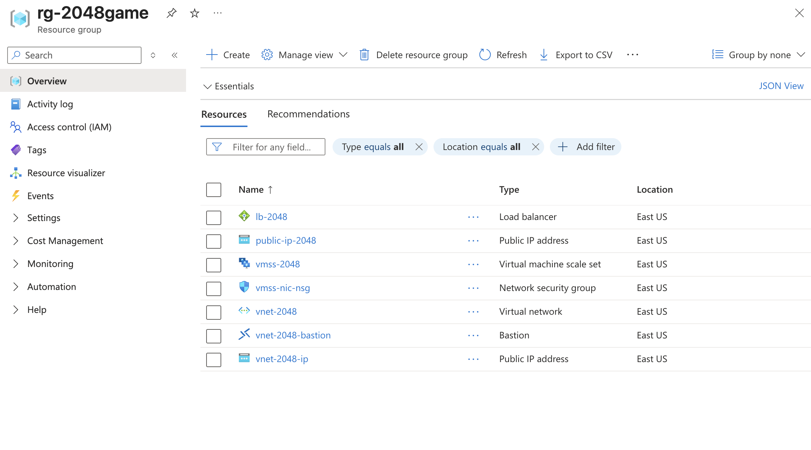
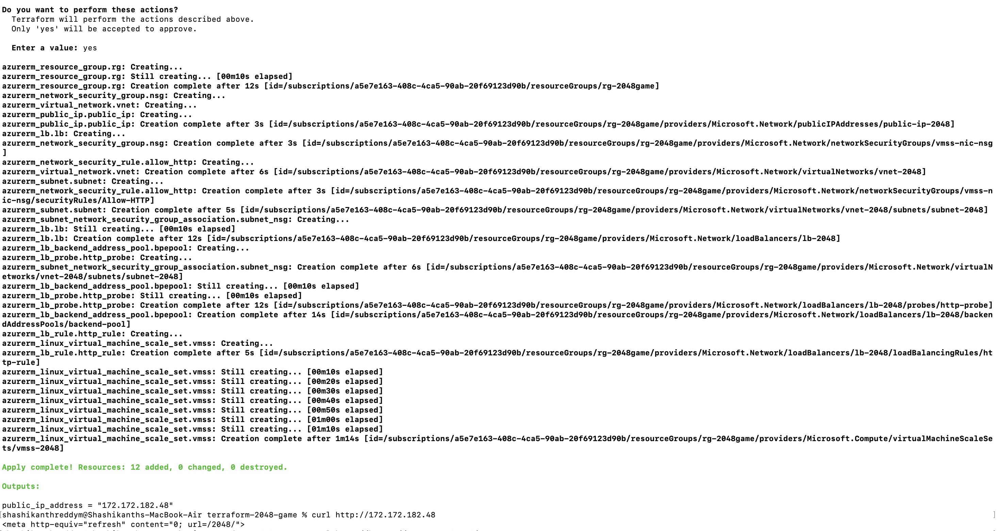
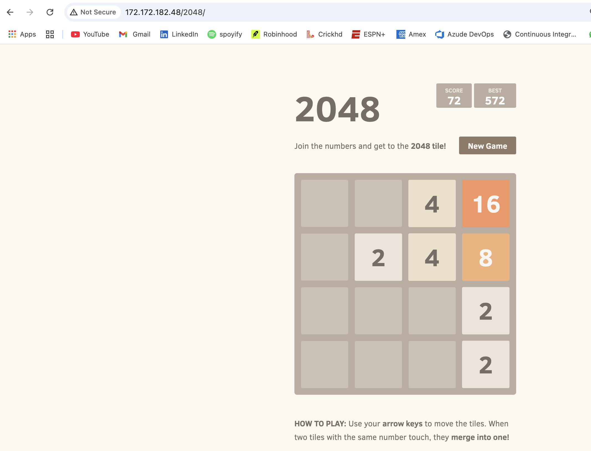
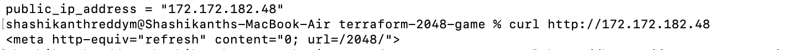

# Terraform-Azure-Infra

🚀 Infrastructure as Code (IaC) project to deploy and manage Azure resources using Terraform.

## 🧱 What I Built

- Deployed a scalable 2048 Game setup on Azure using:
  - Azure Virtual Machine Scale Sets (VMSS)
  - Load Balancer
  - Network Interface, NSG, VNet/Subnet
  - Public IP and NICs

## 🔧 Tools Used

- Terraform
- Azure CLI
- VS Code
- GitHub for version control

## 💡 Why This Project

I built this to get hands-on with real-world Infrastructure as Code in Azure. It helps me understand how scalable and modular deployments can be automated using Terraform modules.

## 📸 Screenshots

### Azure Portal – Resource Group View


---

### Terraform Apply Output (Terminal)


---

### Terraform Output in Browser


---

### Terraform Outputs in Terminal



## 📂 Structure

```bash
├── main.tf
├── variables.tf
├── outputs.tf
├── modules/
│   └── vmss/
└── README.md
